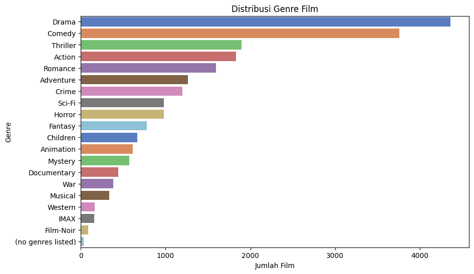

# Laporan Proyek Machine Learning - Naia Shaffa Camila

## Project Overview

Rekomendasi film merupakan fitur penting dalam platform streaming dan aplikasi hiburan untuk membantu pengguna menemukan film yang sesuai dengan preferensi mereka. Dengan banyaknya film yang tersedia, pengguna sering merasa bingung dalam memilih film yang ingin ditonton. Oleh karena itu, sistem rekomendasi yang efektif sangat dibutuhkan untuk meningkatkan pengalaman pengguna dan loyalitas pelanggan.

Dalam proyek ini, saya menggunakan dataset Movie Recommender Dataset dari Kaggle yang berisi informasi rating pengguna terhadap berbagai film. Dataset ini memungkinkan pengembangan sistem rekomendasi berbasis collaborative filtering dan content-based filtering yang dapat memberikan rekomendasi film secara personal.

## Business Understanding

Di era modern ini, produksi film terus meningkat secara signifikan setiap tahunnya. Dengan ribuan film baru yang dirilis dari berbagai genre dan negara, pilihan bagi penonton menjadi sangat banyak dan beragam. Namun, peningkatan kuantitas ini justru membuat pengguna semakin kesulitan menemukan film yang benar-benar sesuai dengan selera dan preferensi mereka. Proses pencarian yang manual dan tidak terarah sering kali membuat pengguna merasa bingung dan frustrasi. Oleh karena itu, diperlukan solusi yang mampu membantu pengguna menavigasi lautan konten film yang terus bertambah ini secara efektif dan efisien. Sistem rekomendasi film yang dapat memahami preferensi pengguna secara mendalam menjadi kunci untuk menghadirkan pengalaman menonton yang lebih personal dan memuaskan. Proyek ini bertujuan untuk mengembangkan sistem rekomendasi yang akurat dan adaptif sehingga pengguna dapat dengan mudah menemukan film yang relevan, sekaligus mendukung pertumbuhan platform streaming dan industri film secara keseluruhan.

### Problem Statements

- Ketidakefisienan dalam Pencarian Film: Dengan semakin banyaknya jumlah film yang diproduksi setiap tahun, pengguna sering kali menghabiskan waktu berjam-jam untuk mencari film yang sesuai dengan preferensi mereka. Hal ini menyebabkan kebingungan dan menurunnya kepuasan dalam pengalaman menonton.

- Keterbatasan dalam Rekomendasi yang Akurat: Algoritma rekomendasi yang kurang optimal sering memberikan saran film yang kurang relevan, sehingga pengguna kehilangan kesempatan untuk menemukan film baru yang sebenarnya cocok dengan minat mereka.

- Tantangan dalam Memahami Preferensi Pengguna: Data rating dan preferensi pengguna yang beragam dan tidak lengkap membuat sistem sulit untuk memberikan rekomendasi yang benar-benar personal dan tepat sasaran.

### Goals

- Menghadirkan Rekomendasi Film yang Relevan dan Personal: Proyek ini bertujuan untuk membangun sistem rekomendasi yang mampu memahami preferensi unik setiap pengguna melalui analisis data rating, sehingga dapat menyarankan film yang benar-benar sesuai dengan selera mereka.

- Meningkatkan Efisiensi dalam Menemukan Film: Dengan menerapkan algoritma yang tepat, sistem rekomendasi diharapkan dapat mengurangi waktu yang dibutuhkan pengguna untuk menemukan film yang diinginkan, sekaligus mengurangi kebingungan akibat banyaknya pilihan.

- Mendorong Eksplorasi Film Baru: Sistem ini juga bertujuan untuk memperkenalkan pengguna pada film-film berkualitas yang mungkin belum pernah mereka pertimbangkan sebelumnya, sehingga memperkaya pengalaman menonton dan meningkatkan kepuasan pengguna secara keseluruhan.

### Solution Statements

Untuk mencapai tujuan yang telah ditetapkan, proyek ini mengusulkan dua pendekatan utama dalam membangun sistem rekomendasi film:

1. **Content-Based Filtering (Menggunakan Cosine Similarity)**  
   Pendekatan content-based filtering ini merekomendasikan film berdasarkan kemiripan karakteristik konten antar film. Dalam proyek ini, sistem fokus pada **genre film** sebagai fitur utama untuk menilai kesamaan antar film. Setiap film direpresentasikan dalam bentuk vektor genre, lalu sistem menghitung **kemiripan antar film** menggunakan **Cosine Similarity**, yaitu pengukuran sudut antara dua vektor dalam ruang dimensi tinggi. Nilai kemiripan akan berada dalam rentang 0 hingga 1, di mana 1 berarti sangat mirip (arah vektor sama), dan 0 berarti tidak mirip (vektor tegak lurus).

2. **Collaborative Filtering (Menggunakan Algoritma NearestNeighbors)**  
   Pendekatan collaborative filtering ini menggunakan algoritma **`NearestNeighbors`** dari pustaka scikit-learn untuk mencari film-film yang mirip berdasarkan pola rating pengguna. Alih-alih fokus pada konten film, pendekatan ini menganalisis kesamaan perilaku pengguna dalam memberikan rating. Sistem akan membentuk **user-item matrix**, di mana setiap baris mewakili pengguna dan setiap kolom mewakili film. Setiap entri pada matriks berisi nilai rating yang diberikan oleh pengguna terhadap film tersebut.

## Data Understanding

Dataset yang digunakan adalah "Movie Recommender Dataset" dari Kaggle ([movie recommender dataset](https://www.kaggle.com/datasets/gargmanas/movierecommenderdataset)) yang berisi 2 file:

**movies.csv**

File ini memuat informasi tentang film, termasuk judul dan genre dari masing-masing film. Terdapat sebanyak **9742 entri film**, masing-masing dengan atribut sebagai berikut:

- `movieId` : ID unik yang merepresentasikan setiap film.
- `title` : Judul lengkap film beserta tahun rilisnya.
- `genres` : Genre film yang ditulis dalam format string dan dipisahkan dengan tanda `|` jika memiliki lebih dari satu genre.

Kondisi data:
- Tidak terdapat duplikat berdasarkan movieId.
- Tidak terdapat missing value di seluruh kolom.

**ratings.csv**

File ini berisi data interaksi pengguna dengan film, berupa rating yang diberikan. Terdapat **100,836 entri rating** dengan atribut sebagai berikut:

- `userId` : ID unik pengguna yang memberikan rating.
- `movieId` : ID film yang dirating oleh pengguna.
- `rating` : Nilai rating yang diberikan pengguna terhadap film, berada pada skala **0.5 hingga 5**.
- `timestamp` : Waktu ketika rating diberikan, dalam format UNIX timestamp.

Kondisi data:
- Tidak terdapat duplikat berdasarkan kombinasi userId dan movieId.
- Tidak terdapat missing value di seluruh kolom.

---

### Visualisasi Awal: Distribusi Genre Film

Untuk memahami komposisi konten yang tersedia dalam dataset, langkah awal yang dilakukan adalah meninjau sebaran genre dari semua film. Genre merupakan fitur penting dalam pendekatan content-based filtering karena mencerminkan jenis atau tema dari film yang disukai pengguna. Oleh karena itu, visualisasi distribusi genre dapat memberikan gambaran umum mengenai preferensi konten serta membantu dalam proses feature engineering ke depan.



### Visualisasi Tambahan: Distribusi Rating Pengguna

Selain memahami jenis konten melalui genre, penting juga untuk meninjau bagaimana pengguna memberikan rating terhadap film. Rating merupakan komponen utama dalam pendekatan collaborative filtering karena model ini mengandalkan pola dan hubungan antar rating pengguna untuk merekomendasikan film. Oleh karena itu, memahami distribusi rating sangat penting untuk mengetahui kecenderungan pengguna dalam menilai film — apakah condong memberikan rating tinggi, rendah, atau tersebar merata Visualisasi distribusi rating dapat memberikan wawasan penting seperti adanya potensi bias (misalnya mayoritas rating tinggi), distribusi tidak seimbang, atau kelangkaan rating ekstrem. Informasi ini akan sangat berguna saat menyusun strategi preprocessing dan dalam membangun user-item matrix yang optimal untuk collaborative filtering.


## Data Preparation

### Content-Based Filtering

- Membuat salinan dataset movies

  ```python
  movies_df = movies.copy()
  ```

  Langkah ini dilakukan agar data asli tetap aman dan proses preprocessing tidak merusak dataset asli.

- Membuat fitur dummy untuk setiap genre

  ```python
  genre_dummies = movies_df['genres'].str.get_dummies(sep='|')
  ```

  Karena setiap film bisa memiliki lebih dari satu genre yang dipisahkan oleh '|', kita mengonversi kolom genre menjadi kolom-kolom biner (0/1) untuk masing-masing genre. Ini memungkinkan model untuk memahami fitur genre secara numerik.

- Menggabungkan data genre dummy dengan dataframe utama

  ```python
  movies_df = pd.concat([movies_df, genre_dummies], axis=1)
  ```

  Fitur genre hasil encoding ditambahkan ke dataframe utama sehingga dapat digunakan sebagai input untuk perhitungan similarity.

- Menghapus baris yang berisi genre ‘(no genres listed)’

  ```python
  movies_df = movies_df[~movies_df['genres'].str.contains(r'\(no genres listed\)')]
  ```

  Baris dengan genre ini dihapus karena tidak memberikan informasi yang berguna untuk analisis dan dapat mengganggu hasil similarity.

- Menghapus kolom dummy ‘(no genres listed)’ jika ada
  ```python
  movies_df.drop('(no genres listed)', axis=1, inplace=True)
  ```
  Setelah penghapusan baris, kolom genre ini juga dihapus agar tidak menjadi fitur yang tidak relevan dalam model.

### Collaborative Filtering - Data Preprocessing

- Menggabungkan dataset ratings dan movies

  ```python
  df = pd.merge(ratings, movies, on='movieId')

  ```

- Membentuk User-Item Matrix

  ```python
  user_item_matrix = df.pivot_table(index='userId', columns='movieId', values='rating')
  ```

  Membuat matriks di mana baris mewakili setiap pengguna (userId), kolom mewakili setiap film (movieId), dan nilai di dalamnya adalah rating yang diberikan pengguna terhadap film tersebut. Matriks ini menjadi dasar untuk model collaborative filtering.

- Mengisi nilai kosong dengan 0
  ```python
  user_item_matrix = user_item_matrix.fillna(0)
  ```
  Karena tidak semua pengguna memberi rating ke semua film, terdapat nilai kosong (NaN). Nilai ini diisi dengan 0 untuk menyatakan bahwa pengguna tersebut belum memberi rating film tersebut. Pengisian ini penting agar algoritma dapat memproses data tanpa error.

## Modeling

### Content-Based Filtering dengan Cosine Similarity

Cosine similarity digunakan dalam Content-Based Filtering untuk mengukur tingkat kemiripan antar film berdasarkan fitur konten, yaitu genre film. Dalam sistem rekomendasi ini, setiap film direpresentasikan sebagai vektor fitur yang menunjukkan kehadiran atau ketidakhadiran genre tertentu (one-hot encoding).

Cosine similarity mengukur seberapa mirip dua vektor dalam ruang multidimensi dengan menghitung cosinus sudut antara kedua vektor tersebut. Jika dua film memiliki genre yang sangat mirip, maka sudut antara vektor fitur mereka akan kecil sehingga nilai cosine similarity mendekati 1. Sebaliknya, jika genre film sangat berbeda, nilai similarity mendekati 0.

Rumus cosine similarity antara vektor A dan B adalah:

```python
cosine_similarity(A, B) = (A · B) / (||A|| × ||B||)
```

Keterangan:

- `A · B` : _dot product_ (perkalian titik) antara vektor A dan B
- `||A||` dan `||B||` : magnitudo (norma) dari vektor A dan B

Penggunaan cosine similarity memungkinkan sistem rekomendasi untuk menghasilkan matriks kemiripan antar film berdasarkan genre, sehingga dapat memberikan rekomendasi film yang memiliki konten genre serupa dengan film yang disukai pengguna.

### 🎯 Rekomendasi Film Berdasarkan Cosine Similarity (Toy Story (1995))

| No | Rekomendasi Film                                              | Cosine Similarity | Genre Rekomendasi                               | Precision Genre |
|----|---------------------------------------------------------------|-------------------|--------------------------------------------------|-----------------|
| 1  | Antz (1998)                                                   | 1.0               | Adventure\|Animation\|Children\|Comedy\|Fantasy  | 1.0             |
| 2  | Toy Story 2 (1999)                                            | 1.0               | Adventure\|Animation\|Children\|Comedy\|Fantasy  | 1.0             |
| 3  | Adventures of Rocky and Bullwinkle, The (2000)               | 1.0               | Adventure\|Animation\|Children\|Comedy\|Fantasy  | 1.0             |
| 4  | Emperor's New Groove, The (2000)                              | 1.0               | Adventure\|Animation\|Children\|Comedy\|Fantasy  | 1.0             |
| 5  | Monsters, Inc. (2001)                                         | 1.0               | Adventure\|Animation\|Children\|Comedy\|Fantasy  | 1.0             |
| 6  | Wild, The (2006)                                              | 1.0               | Adventure\|Animation\|Children\|Comedy\|Fantasy  | 1.0             |
| 7  | Shrek the Third (2007)                                        | 1.0               | Adventure\|Animation\|Children\|Comedy\|Fantasy  | 1.0             |
| 8  | Tale of Despereaux, The (2008)                                | 1.0               | Adventure\|Animation\|Children\|Comedy\|Fantasy  | 1.0             |
| 9  | Asterix and the Vikings (Astérix et les Vikings) (2006)       | 1.0               | Adventure\|Animation\|Children\|Comedy\|Fantasy  | 1.0             |
| 10 | Turbo (2013)                                                  | 1.0               | Adventure\|Animation\|Children\|Comedy\|Fantasy  | 1.0             |


### Collaborative Filtering dengan Nearest Neighbors dan Cosine Similarity

Model **Nearest Neighbors** menggunakan metode *k-nearest neighbors* (KNN) untuk mencari film-film yang paling mirip berdasarkan pola rating pengguna. Data yang digunakan adalah **user-item matrix**, di mana setiap baris mewakili pengguna dan setiap kolom mewakili film, dengan nilai berupa rating yang diberikan pengguna.

Pada model ini digunakan:

- `metric='cosine'`: Menggunakan *cosine similarity* sebagai ukuran kemiripan antar film.  
- `algorithm='brute'`: Melakukan pencarian jarak secara langsung (brute force), cocok untuk dataset berukuran sedang.  
- `n_neighbors=11`: Mencari 11 tetangga terdekat, yaitu 10 film paling mirip plus film itu sendiri.  
- `n_jobs=-1`: Memanfaatkan semua core CPU untuk mempercepat perhitungan.

#### Cara Kerja Model

1. Model mengambil **user-item matrix** yang sudah di-*transpose* sehingga baris mewakili film dan kolom mewakili pengguna (atau sebaliknya sesuai implementasi).  
2. Untuk setiap film, model mencari film-film lain dengan **cosine similarity tertinggi** (pola rating pengguna yang mirip).  
3. Film-film dengan nilai cosine similarity tertinggi direkomendasikan sebagai film yang mirip.

#### 🔍 10 Film yang Mirip dengan Toy Story (1995)

| No | movieId | Title                                                 | Similarity | Avg Rating |
|----|---------|--------------------------------------------------------|------------|-------------|
| 1  | 3114    | Toy Story 2 (1999)                                     | 0.572601   | 3.86        |
| 2  | 480     | Jurassic Park (1993)                                   | 0.565637   | 3.75        |
| 3  | 780     | Independence Day (a.k.a. ID4) (1996)                   | 0.564262   | 3.45        |
| 4  | 260     | Star Wars: Episode IV - A New Hope (1977)             | 0.557388   | 4.23        |
| 5  | 356     | Forrest Gump (1994)                                    | 0.547096   | 4.16        |
| 6  | 364     | Lion King, The (1994)                                  | 0.541145   | 3.94        |
| 7  | 1210    | Star Wars: Episode VI - Return of the Jedi (1983)     | 0.541089   | 4.14        |
| 8  | 648     | Mission: Impossible (1996)                             | 0.538913   | 3.54        |
| 9  | 1265    | Groundhog Day (1993)                                   | 0.534169   | 3.94        |
| 10 | 1270    | Back to the Future (1985)                              | 0.530381   | 4.04        |


## Evaluation

### Content-Based Filtering

- **Precision Similarity Score = 1.0**  
  Menunjukkan bahwa secara vektor genre, film-film rekomendasi **identik** dengan film pencarian.
- **Precision Genre = 1.0**  
  Menunjukkan bahwa semua genre pada film pencarian juga **sepenuhnya terdapat** pada setiap film rekomendasi.

---

### Collaborative Filtering

Pada evaluasi model Collaborative Filtering berbasis K-Nearest Neighbors (KNN), dilakukan pengukuran performa menggunakan dua metrik utama, yaitu:
- RMSE (Root Mean Squared Error): 2.1126
- MAE (Mean Absolute Error): 1.73

---

## Kesimpulan
Proyek ini berhasil membangun sistem rekomendasi film menggunakan metode Content-Based Filtering dan Collaborative Filtering dengan data MovieLens 100K. Metode content-based menunjukkan hasil baik dalam merekomendasikan film berdasarkan kemiripan genre, sementara collaborative filtering mampu menangkap preferensi pengguna melalui pola rating, meskipun hasil evaluasinya (RMSE 2.11 dan MAE 1.73) menunjukkan masih adanya ruang untuk perbaikan.

Secara keseluruhan, kedua pendekatan memiliki kelebihan dan kekurangannya masing-masing. Untuk hasil yang lebih akurat dan personal, sistem rekomendasi ini berpotensi ditingkatkan dengan pendekatan hybrid dan pemanfaatan fitur tambahan seperti data aktor, sutradara, atau ulasan pengguna.